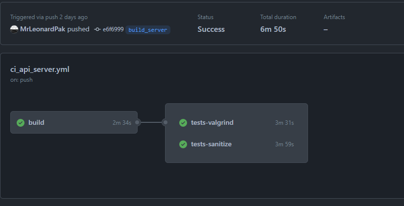
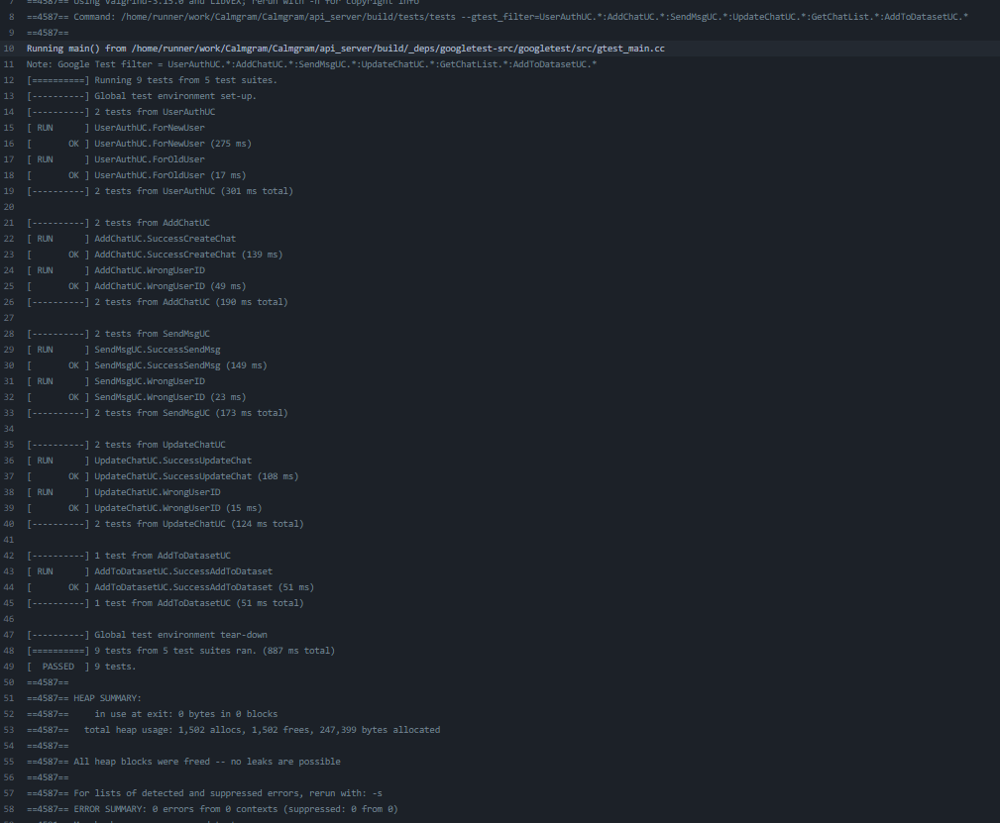
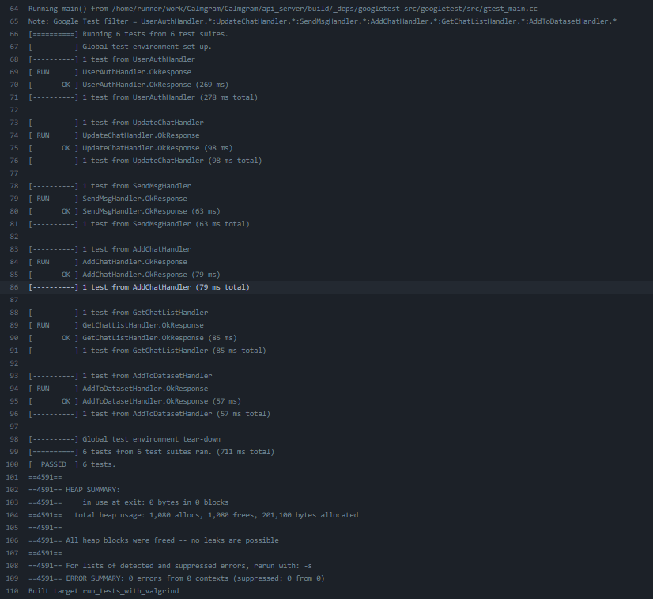

# Отчет по использованию CI

## API Server (Леонард)

### CI запускает в начале build, и при успешном запускает тесты под санитайзером и валгриндом по отдельности
  

### Тесты написаны на Use Case-ы и на Handler-ы
Пример (С valgrind)
  
  

[Ссылка на CI](https://github.com/MrLeonardPak/Calmgram/blob/api_server_28_05/.github/workflows/ci_api_server.yml)
[Ссылка на тесты](https://github.com/MrLeonardPak/Calmgram/tree/api_server_28_05/api_server/tests)

## ML (Алан)

