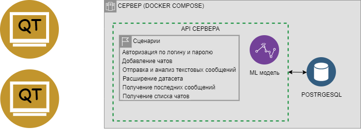

# Общая сводка
## Минимальный план
1. Обмен текстовыми сообщениями и изображениями http-запросами
2. Цензурированию текстовых сообщений, связанных с политикой
## Максимальный план (* - к оптимальному плану) - выполняется поочередно
1. *Авторизация и хранение личных данных
2. *Групповой чат и каналы
3. Анализ изображений на политическую тему
4. Переход на постоянноянное соединение через WebSocket
5. Сохранение неотправленного текста (Черновик)
6. Переход на диманическую ml-модель, добавление возможности отравлять feedback о сообщении
7. Оценка качества пользователя
8. Шифрование
## Используемые технологии
### **QT** 
В клиентском приложении используется фреймворк QT для создание пользовательского интерфейса.
### **Docker**
Весь сервер должен быть обернут в docker контейнер. **Возможно (но не точно):** использовать docker compose.
### **Nginx**
Nginx используется в качестве обратного прокси-сервера для сокрытия внутренней системы сервера и для централизованного взаимодействия внутри сервера.

# Обобщенная диаграмма проекта
  
# UML диаграма application server (Леонард)
  
# UML диаграма client (Иван)
 
# UML диаграма ML model (Алан)

